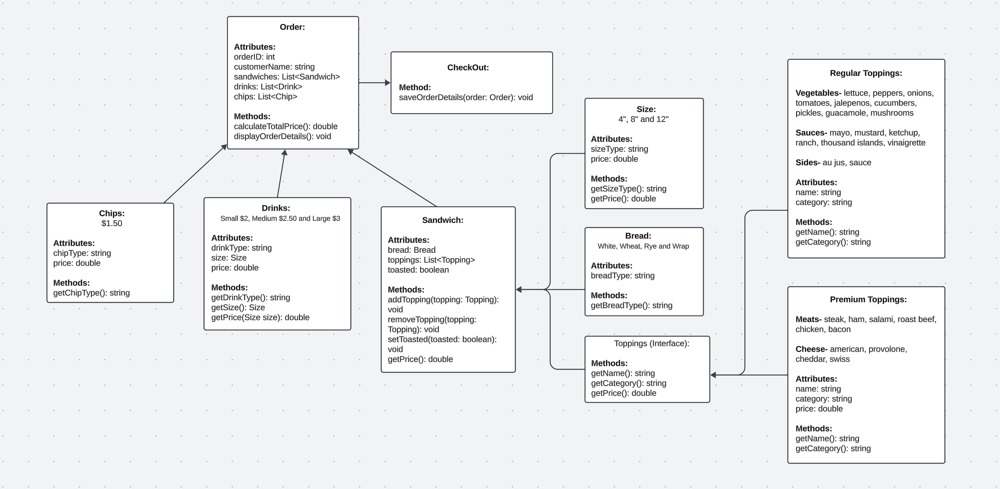

# SIR-Licious | Sandwhich Shop
**Created By:**
- Randy Lopez
- Igor "Ivan" Tavarez
- Chanthapone "Sing" Tuttanon

## Table of Contents:
- [Overview](#overview)
- [Project Structure](#project-structure)
- [Project Diagram](#project-diagram)
- [Code Highlight](@code-highlight)
- [Resources](#resources)

## Overview
// Will configure a more elaborate overview...

SIR-Licious, is a Sandwich ordering application that allows customers (users) to place orders for sandwiches, drinks, and chips. 

## Project Structure
// Will include demo pictures in this section...

Java Classes:
- 1
- 2
- 3
- 4
- 5
- 6
- 7
- 8
- 9
- 10
- 11
- 12
- 13

## Project Diagram

## Code Highlight
TBD

## Resources
TBD