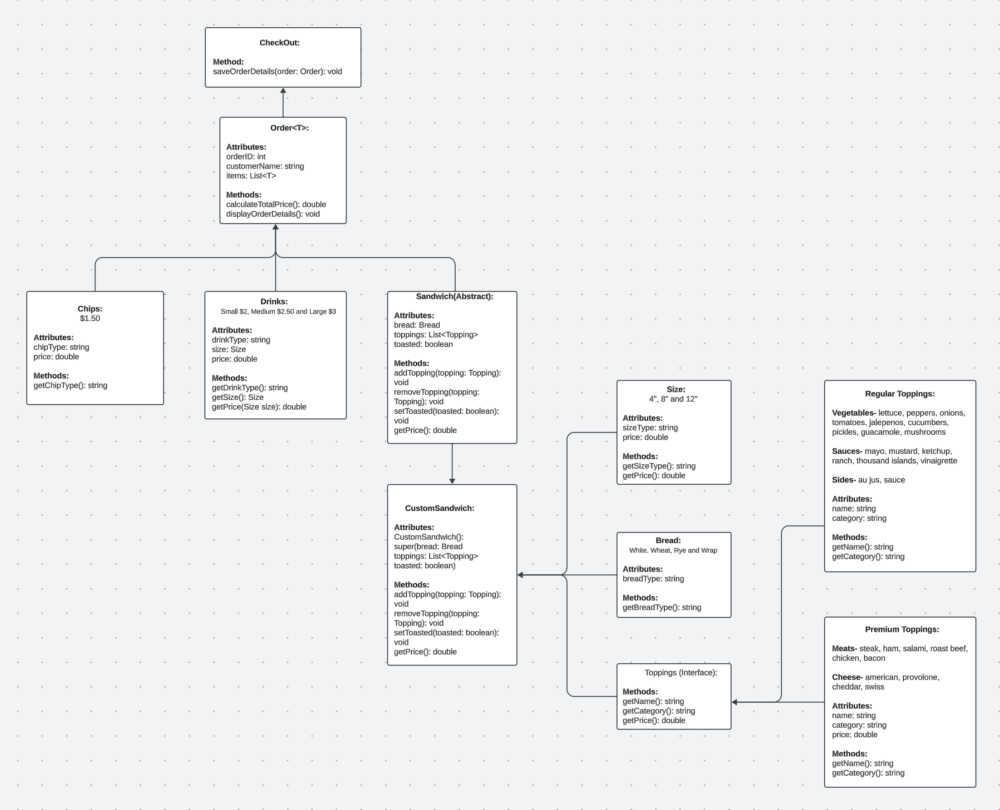

# SIR-Licious | Sandwhich Shop

**Created By:**
- Randy Lopez
- Igor "Ivan" Tavarez
- Chanthapone "Sing" Tuttanon

## Table of Contents:
- [Overview](#overview)
- [Project Structure](#project-structure)
- [Project Diagram](#project-diagram)
- [Code Highlight](#code-highlight)
- [Resources](#resources)

## Overview
// Will configure a more elaborate overview...

**Development**

Our team collectively developed the SIR-Licious application, aiming to deliver a user-friendly and efficient ordering system. 

**Application**

SIR-Licious, is a Sandwich ordering application that allows customers (users) to create a custom sandwich order(s) with various options for bread type, toppings, drinks, and chips. The application provides a user-friendly interface to add items to an order, review the order, and proceed to checkout.

## Project Structure 

Screens | Package
- Main: Main class for entrypoint of the application.
- MainMenu: Handles the main menu interface.
- OrderMenu: Provide functionality for customers to place orders.
- SandwichMenu: Handles the sandwich customization process.

  *Will include screen demo pictures in this section...*

Support | Sub-Package under "Screens"
- Order: Manages the order information, including items such as sandwich(es), drink(s), and chip(s).
- CheckOut: Handles the checkout process, including order summary, total cost calculation, and file handling for reading and writing orders.

Sandwich | Package
- Sandwich (Abstract): Abstract class defining the structure of a sandwich.
- Size: Represents different sizes available for sandwich(es).
- Bread: Represents different types of bread for sandwich(es).

Toppings | Sub-Package under "Sandwich"
- Toppings (Interface): Defines the contract for toppings.
- PremiumToppings: Abstract class representing premium toppings.
- Meat: Represents meat toppings for sandwiches.
- Cheese: Represents cheese toppings for sandwiches.
- RegularToppings: Represents regular toppings.
- RegularList: Provides lists of regular toppings (Vegetables, Sauces, Sides).

Combo | Package
- Chips: Represents various types of chips available for orders.
- Drinks: Represents different drink options and sizes.

## Project Diagram

## Code Highlight
TBD

## Resources
TBD
